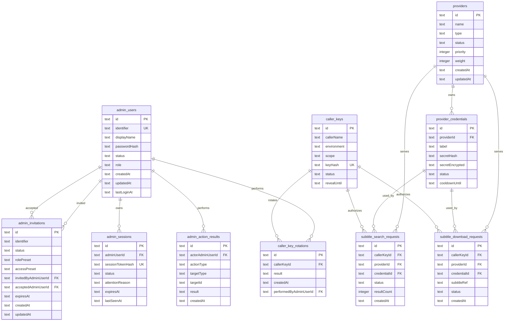

# MVP 管理控制台与统一字幕出口 - 数据库设计

## 1. 文档定位

本文件是 `001-mvp-admin-console` 的数据库落地设计基线，面向实现阶段的 Drizzle schema、migration、数据库访问层、后端服务、测试与未来数据库迁移。它不是纯产品层 data model，也不替代 API 契约或页面规范。

本文件与 `data-model.md` 的关系如下：

- `data-model.md` 负责定义业务实体、领域语义、状态含义、验证规则与用户故事边界。
- `database-design.md` 负责把这些领域模型落成数据库表、字段、约束、索引、敏感数据处理、迁移策略与未来迁移边界。
- 如果实现阶段发现业务实体语义需要改变，应先回写 `data-model.md`；如果只是表结构、索引、migration 或存储实现细节变化，应更新本文件。

本设计的目标是让后续实现可以稳定推进：

- `src/server/storage/schema.ts` 可以按本文定义实现 Drizzle schema。
- `src/server/storage/migrations/` 可以按本文定义生成和维护 migration。
- 后端 service 可以基于本文明确查询路径、状态流转和约束。
- 测试可以验证 schema、约束、索引依赖查询和敏感数据不可泄露。
- 未来迁移到 PostgreSQL / Supabase Postgres 时，当前字段语义和关系约束仍可复用。

## 2. 技术选型结论

当前 MVP 数据库技术方案固定为：

- **数据库**: SQLite
- **ORM / schema**: Drizzle ORM
- **迁移工具**: drizzle-kit

选择该方案的原因：

- **适合单实例自托管 MVP**: 当前 feature 面向单维护者或小团队，SQLite 足以承载首版后台配置、凭据池、调用方 Key、查询/下载记录摘要和管理动作结果。
- **部署与运维成本低**: SQLite 不要求独立数据库服务，适合 Docker、本地开发、轻量 VPS 和个人 NAS 场景。
- **便于本地开发与快速迭代**: 开发、测试和演示环境都可以使用本地 SQLite 文件或临时测试数据库，降低初始门槛。
- **保持 schema discipline**: Drizzle schema 与 drizzle-kit migration 让轻量数据库也具备可追踪结构演进，避免手工改表造成漂移。
- **保留 PostgreSQL 迁移空间**: 只要字段类型、唯一约束、外键、时间字段和索引设计保持克制，未来用户规模、写并发或部署拓扑扩大时，可以迁移到 PostgreSQL / Supabase Postgres。

当前阶段不引入 Prisma、外部托管数据库、事件溯源、分库分表、读写分离或复杂审计仓库。此类能力不属于 MVP。

## 3. 仓库路径与约定

数据库相关路径约定如下：

| 目的 | 路径 |
|------|------|
| Drizzle schema | `src/server/storage/schema.ts` |
| migration 文件 | `src/server/storage/migrations/` |
| 数据库访问入口 | `src/server/storage/client.ts` |
| Drizzle 配置 | `drizzle.config.ts` |
| 数据库相关单元测试 | `tests/unit/storage/schema.test.ts` |
| 集成测试数据库辅助 | `tests/setup.ts` |

实现约定：

- `src/server/storage/schema.ts` 是数据库结构的 TypeScript 真源。
- `drizzle.config.ts` 必须指向 `src/server/storage/schema.ts` 与 `src/server/storage/migrations/`。
- `src/server/storage/client.ts` 负责创建 SQLite 连接、Drizzle 实例、事务封装和测试数据库切换。
- 业务服务不得直接绕过 `src/server/storage/client.ts` 创建数据库连接。
- migration 文件必须提交到 Git，作为数据库结构历史的一部分。
- 测试环境应使用独立 SQLite 文件或内存数据库，不得污染开发或生产数据库文件。

## 4. 数据库设计原则

本 feature 的数据库设计遵循以下原则：

1. **schema 清晰优先**: 表名、字段名、状态枚举和关系必须能直接映射到 `data-model.md` 与 API 契约中的领域对象。
2. **所有结构变更必须通过 migration 管理**: 不允许只修改本地数据库而不生成或提交 migration。
3. **migration 文件纳入 Git**: migration 是数据库结构历史，不是临时构建产物。
4. **不依赖 SQLite 宽松行为作为长期契约**: 字段语义、非空约束、唯一约束、外键和状态枚举必须在 Drizzle schema、数据库约束和测试中显式表达。
5. **保持 PostgreSQL 可迁移性**: ID、时间字段、状态字段、外键、唯一约束和索引设计应避免 SQLite 专属假设。
6. **敏感数据最小化持久化**: 密码、Provider 凭据、Caller Key 明文不得以普通文本入库。
7. **读模型不强行持久化**: Dashboard / Settings 的 `SystemReadiness` 等聚合对象优先由服务层读取多表生成。
8. **MVP 边界清晰**: 不为权限矩阵、审批流、完整 RBAC、审计导出、高级风险分析、风控策略系统或多租户预先设计复杂表结构。
9. **状态流转可测试**: 成员、邀请、会话、Provider、凭据、Caller Key 的状态变化必须可通过服务测试和 schema 约束验证。
10. **查询场景驱动索引**: 索引服务于当前后台页面、API 授权、Provider 调度、请求记录摘要和动作结果追踪，不预建大量未使用索引。

## 5. 表设计

### 5.1 `admin_users`

**用途**: 存储可登录管理控制台的后台成员，包括首个管理员和后续邀请加入的维护成员。

| 字段 | 类型建议 | 约束 | 说明 |
|------|----------|------|------|
| `id` | text | primary key | 稳定唯一标识，建议使用 `admin_` 前缀 ULID/CUID |
| `identifier` | text | not null, unique | 登录标识，邮箱或用户名；建议保存规范化小写值 |
| `displayName` | text | not null | 后台显示名称 |
| `passwordHash` | text | not null | 管理员密码哈希，不存明文 |
| `status` | text | not null | `active`、`suspended` |
| `role` | text | not null | MVP 预设角色，如 `admin`、`operator`；不承载完整 RBAC |
| `createdAt` | text | not null | ISO 8601 UTC 时间 |
| `updatedAt` | text | not null | ISO 8601 UTC 时间 |
| `lastLoginAt` | text | nullable | 最近成功登录时间 |

**主键**: `id`

**唯一约束**:

- `admin_users.identifier` 唯一。

**外键**: 无。

**关键状态字段**:

- `status`: 被暂停成员不得登录或执行受保护后台动作。
- `role`: 仅为 MVP 预设角色展示与粗粒度服务判断，不引入权限矩阵。

**备注**:

- `passwordHash` 必须由密码哈希算法生成，普通日志、错误响应和 AdminActionResult message 均不得包含原始密码。
- 成员暂停时，应由服务层撤销或阻止其既有 active session 执行受保护动作。

### 5.2 `admin_invitations`

**用途**: 存储后台成员邀请。MVP 中只支持轻量邀请、预设角色和预设接入范围，不承载审批流、权限矩阵或完整身份治理。

| 字段 | 类型建议 | 约束 | 说明 |
|------|----------|------|------|
| `id` | text | primary key | 稳定唯一标识，建议使用 `invite_` 前缀 |
| `identifier` | text | not null | 被邀请成员的邮箱或登录标识，建议规范化小写 |
| `status` | text | not null | `pending`、`accepted`、`expired`、`revoked` |
| `rolePreset` | text | not null | MVP 预设角色，如 `admin`、`operator` |
| `accessPreset` | text | not null | MVP 预设接入范围，如 `admin_console` |
| `invitedByAdminUserId` | text | not null, foreign key | 创建邀请的管理员 |
| `acceptedAdminUserId` | text | nullable, foreign key | 接受邀请后创建或绑定的后台成员 |
| `expiresAt` | text | not null | 邀请过期时间 |
| `acceptedAt` | text | nullable | 接受时间 |
| `revokedAt` | text | nullable | 撤销时间 |
| `createdAt` | text | not null | 创建时间 |
| `updatedAt` | text | not null | 更新时间 |

**主键**: `id`

**唯一约束**:

- 同一 `identifier` 不应同时存在多个有效 `pending` 邀请。
- SQLite 无跨数据库通用的部分唯一索引语义约定时，推荐在 Drizzle migration 中创建部分唯一索引：`unique where status = 'pending'`。
- 若实现选择避免 SQLite 部分索引，应在 service 层事务中检查并通过测试覆盖，但首选数据库层约束。

**外键**:

- `invitedByAdminUserId` -> `admin_users.id`
- `acceptedAdminUserId` -> `admin_users.id`

**关键状态字段**:

- `status`: 只有 `pending` 可接受；`expired`、`revoked` 不得接受。

**备注**:

- `rolePreset` 与 `accessPreset` 只引用 MVP 预设值，不存储自定义权限策略。
- 接受邀请后必须在同一事务中更新邀请状态并创建或绑定 `admin_users`。

### 5.3 `admin_sessions`

**用途**: 存储后台登录会话。MVP 中需要关注的会话仅用于基础处置，不代表完整风险评分、设备指纹或风控策略系统。

| 字段 | 类型建议 | 约束 | 说明 |
|------|----------|------|------|
| `id` | text | primary key | 稳定唯一标识，建议使用 `session_` 前缀 |
| `adminUserId` | text | not null, foreign key | 会话所属后台成员 |
| `sessionTokenHash` | text | not null, unique | 会话令牌哈希，不存明文 cookie token |
| `status` | text | not null | `active`、`revoked`、`expired`、`needs_attention`、`remediated` |
| `createdAt` | text | not null | 创建时间 |
| `expiresAt` | text | not null | 过期时间 |
| `lastSeenAt` | text | nullable | 最近访问时间 |
| `deviceLabel` | text | nullable | 简短设备/浏览器说明 |
| `attentionReason` | text | nullable | 基础关注原因，对应 data-model 中 `riskReason` 的收窄实现 |
| `remediatedAt` | text | nullable | 基础处置完成时间 |
| `remediatedByAdminUserId` | text | nullable, foreign key | 执行处置的管理员 |

**主键**: `id`

**唯一约束**:

- `sessionTokenHash` 唯一。

**外键**:

- `adminUserId` -> `admin_users.id`
- `remediatedByAdminUserId` -> `admin_users.id`

**关键状态字段**:

- `active`: 可访问受保护后台页面和管理端 API。
- `revoked`、`expired`、`needs_attention`: 不得继续执行受保护后台管理动作。
- `remediated`: 表示管理员已完成基础处置。

**备注**:

- 本文使用 `needs_attention` 作为数据库落地状态，对应 `data-model.md` 中 `risk` 的收窄语义，避免实现阶段误扩展为风控平台。
- `attentionReason` 是基础说明字段，不存储风险评分、设备指纹画像或策略判定细节。

### 5.4 `providers`

**用途**: 存储上游字幕来源实例，首发只要求 OpenSubtitles。

| 字段 | 类型建议 | 约束 | 说明 |
|------|----------|------|------|
| `id` | text | primary key | 稳定唯一标识，建议使用 `provider_` 前缀 |
| `name` | text | not null | 管理端显示名称 |
| `type` | text | not null | MVP 首发 `opensubtitles` |
| `status` | text | not null | `enabled`、`disabled`、`needs_config`、`degraded` |
| `priority` | integer | not null, default 100 | 调度优先级，数字越小越优先或按实现约定固定 |
| `weight` | integer | not null, default 100 | 同类 Provider 权重 |
| `concurrencyLimit` | integer | not null, default 1 | 并发限制 |
| `rotationEnabled` | integer | not null, default 1 | SQLite boolean，0/1 |
| `cooldownSeconds` | integer | not null, default 60 | 凭据失败后的默认冷却秒数 |
| `fallbackProviderId` | text | nullable, foreign key | 后续多 Provider 时的 fallback；MVP 可为空 |
| `lastHealthStatus` | text | nullable | 最近健康状态摘要 |
| `lastErrorSummary` | text | nullable | 最近错误摘要，不含敏感凭据 |
| `createdAt` | text | not null | 创建时间 |
| `updatedAt` | text | not null | 更新时间 |

**主键**: `id`

**唯一约束**:

- 建议 `providers(type, name)` 唯一，保证同类型 Provider 名称可区分。

**外键**:

- `fallbackProviderId` -> `providers.id`，MVP 可为空。

**关键状态字段**:

- `needs_config`: 新建后尚未满足可服务条件。
- `enabled`: 可参与服务，但服务层仍必须检查是否有 active credential。
- `degraded`: 可部分服务或存在异常。
- `disabled`: 管理员停用，不参与调度。

**备注**:

- `fallbackProviderId` 是低成本未来兼容字段，不代表当前 MVP 实现多 Provider 通用接入模型。
- `lastErrorSummary` 只保存可展示摘要，不得包含 Provider API Key 明文。

### 5.5 `provider_credentials`

**用途**: 存储绑定到 Provider 的上游 Token / API Key，可独立参与调度、冷却、隔离、恢复或停用。

| 字段 | 类型建议 | 约束 | 说明 |
|------|----------|------|------|
| `id` | text | primary key | 稳定唯一标识，建议使用 `cred_` 前缀 |
| `providerId` | text | not null, foreign key | 所属 Provider |
| `label` | text | not null | 管理端显示标签 |
| `secretHash` | text | not null | 凭据哈希，用于去重或安全比对 |
| `secretEncrypted` | text | not null | 加密后的上游凭据，用于实际调用 Provider |
| `displayPrefix` | text | nullable | 受控展示前缀 |
| `displaySuffix` | text | nullable | 受控展示后缀 |
| `status` | text | not null | `active`、`cooldown`、`isolated`、`disabled`、`exhausted` |
| `remainingQuota` | integer | nullable | 最近已知剩余额度 |
| `lastUsedAt` | text | nullable | 最近使用时间 |
| `lastErrorAt` | text | nullable | 最近错误时间 |
| `lastErrorSummary` | text | nullable | 最近错误摘要，不含明文凭据 |
| `cooldownUntil` | text | nullable | 冷却结束时间 |
| `createdAt` | text | not null | 创建时间 |
| `updatedAt` | text | not null | 更新时间 |

**主键**: `id`

**唯一约束**:

- 建议 `provider_credentials(providerId, label)` 唯一，避免同 Provider 下标签混淆。
- 建议 `provider_credentials(providerId, secretHash)` 唯一，避免同 Provider 重复录入同一凭据。

**外键**:

- `providerId` -> `providers.id`

**关键状态字段**:

- 只有 `active` 且 `cooldownUntil` 为空或已过期的凭据可参与新请求调度。
- `isolated`、`disabled`、`exhausted` 不得参与调度。

**备注**:

- `secretEncrypted` 需要可解密，因为调用 OpenSubtitles 时必须使用真实上游凭据。
- `secretHash` 不能代替 `secretEncrypted`，二者用途不同。
- 普通列表和详情只展示 `displayPrefix` / `displaySuffix`，不返回完整明文。

### 5.6 `caller_keys`

**用途**: 存储分配给外部应用的下游访问凭据，用于统一字幕查询与下载 API 认证。

| 字段 | 类型建议 | 约束 | 说明 |
|------|----------|------|------|
| `id` | text | primary key | 稳定唯一标识，建议使用 `ck_` 前缀 |
| `callerName` | text | not null | 调用方名称 |
| `environment` | text | not null | `production`、`staging`、`development` |
| `scope` | text | not null | MVP 默认 `subtitles:read` |
| `quotaPolicy` | text | not null | MVP 可为 `default` |
| `keyHash` | text | not null, unique | Caller Key 哈希，用于认证 |
| `keyPrefix` | text | nullable | 展示前缀 |
| `keySuffix` | text | nullable | 展示后缀 |
| `status` | text | not null | `active`、`suspended`、`rotated` |
| `createdAt` | text | not null | 创建时间 |
| `updatedAt` | text | not null | 更新时间 |
| `lastUsedAt` | text | nullable | 最近使用时间 |
| `lastRotatedAt` | text | nullable | 最近轮换时间 |
| `revealUntil` | text | nullable | 新建或轮换后的受控明文展示截止时间 |
| `revealTokenHash` | text | nullable | 可选，一次性 reveal 令牌哈希 |

**主键**: `id`

**唯一约束**:

- `caller_keys.keyHash` 唯一。

**外键**: 无。

**关键状态字段**:

- `active`: 可认证对外字幕查询和下载请求。
- `suspended`: 立即拒绝新请求。
- `rotated`: 旧 Key 失效，不得认证新请求。

**备注**:

- Caller Key 完整明文不应长期持久化。
- `revealUntil` 表示 UI 可展示一次性明文的窗口，但不意味着数据库保存明文。
- 如果实现必须支持刷新页面后仍短暂 reveal，应使用临时加密存储并设置严格过期；默认推荐只在创建/轮换响应中返回一次明文。

### 5.7 `caller_key_rotations`

**用途**: 记录调用方 Key 轮换结果，支持 API Keys 页面展示最近轮换和排障。

| 字段 | 类型建议 | 约束 | 说明 |
|------|----------|------|------|
| `id` | text | primary key | 稳定唯一标识，建议使用 `ckr_` 前缀 |
| `callerKeyId` | text | not null, foreign key | 被轮换的 Caller Key |
| `oldKeySuffix` | text | nullable | 旧 Key 后缀 |
| `newKeySuffix` | text | nullable | 新 Key 后缀 |
| `result` | text | not null | `success`、`failed` |
| `reason` | text | nullable | 失败或说明，不含明文 Key |
| `createdAt` | text | not null | 轮换时间 |
| `performedByAdminUserId` | text | nullable, foreign key | 操作管理员 |

**主键**: `id`

**唯一约束**: 无。

**外键**:

- `callerKeyId` -> `caller_keys.id`
- `performedByAdminUserId` -> `admin_users.id`

**关键状态字段**:

- `result`: 用于区分成功轮换与失败尝试。

**备注**:

- 轮换记录不得保存完整旧 Key 或完整新 Key。
- `reason` 不得包含明文 Key、Provider 凭据或密码。

### 5.8 `subtitle_search_requests`

**用途**: 记录外部应用发起的统一字幕查询动作摘要，用于最近使用、服务质量排查和 Settings/Dashboard 状态判断。

| 字段 | 类型建议 | 约束 | 说明 |
|------|----------|------|------|
| `id` | text | primary key | 稳定唯一标识，建议使用 `search_` 前缀 |
| `callerKeyId` | text | nullable, foreign key | 认证成功时关联 Caller Key；未授权请求可为空 |
| `mediaTitle` | text | not null | 查询标题 |
| `mediaYear` | integer | nullable | 年份 |
| `season` | integer | nullable | 季 |
| `episode` | integer | nullable | 集 |
| `language` | text | nullable | 字幕语言 |
| `status` | text | not null | `success`、`no_results`、`service_not_ready`、`unauthorized`、`provider_failed` |
| `resultCount` | integer | not null, default 0 | 返回结果数量 |
| `providerId` | text | nullable, foreign key | 实际使用的 Provider |
| `credentialId` | text | nullable, foreign key | 实际使用的 ProviderCredential |
| `durationMs` | integer | nullable | 请求耗时 |
| `createdAt` | text | not null | 创建时间 |

**主键**: `id`

**唯一约束**: 无。

**外键**:

- `callerKeyId` -> `caller_keys.id`
- `providerId` -> `providers.id`
- `credentialId` -> `provider_credentials.id`

**关键状态字段**:

- `status`: 必须区分 `no_results` 与 `provider_failed`，避免把无结果误判为上游失败。

**备注**:

- 当前 MVP 记录请求摘要，不持久化完整上游响应或字幕文件内容。
- `mediaTitle` 可能包含用户输入，日志和错误输出中应按普通用户输入处理，不拼接到敏感上下文。

### 5.9 `subtitle_download_requests`

**用途**: 记录外部应用发起的统一字幕下载动作摘要。

| 字段 | 类型建议 | 约束 | 说明 |
|------|----------|------|------|
| `id` | text | primary key | 稳定唯一标识，建议使用 `download_` 前缀 |
| `callerKeyId` | text | nullable, foreign key | 认证成功时关联 Caller Key；未授权请求可为空 |
| `subtitleRef` | text | not null | Provider 返回或网关生成的字幕引用 |
| `providerId` | text | nullable, foreign key | 实际使用的 Provider |
| `credentialId` | text | nullable, foreign key | 实际使用的 ProviderCredential |
| `status` | text | not null | `success`、`not_found`、`service_not_ready`、`unauthorized`、`provider_failed` |
| `contentType` | text | nullable | 下载响应类型，如 `application/x-subrip` |
| `durationMs` | integer | nullable | 请求耗时 |
| `createdAt` | text | not null | 创建时间 |

**主键**: `id`

**唯一约束**: 无。

**外键**:

- `callerKeyId` -> `caller_keys.id`
- `providerId` -> `providers.id`
- `credentialId` -> `provider_credentials.id`

**关键状态字段**:

- `status`: 必须区分 `not_found`、`service_not_ready`、`unauthorized` 和 `provider_failed`。

**备注**:

- 当前 MVP 不持久化字幕文件内容。
- `subtitleRef` 不应包含 Provider API Key、Caller Key 或其他密钥材料。

### 5.10 `admin_action_results`

**用途**: 记录关键管理动作结果，用于后台反馈、最近行为、排障和 code review 可追溯性。它不是完整审计导出系统。

| 字段 | 类型建议 | 约束 | 说明 |
|------|----------|------|------|
| `id` | text | primary key | 稳定唯一标识，建议使用 `aar_` 前缀 |
| `actorAdminUserId` | text | nullable, foreign key | 执行动作的管理员；bootstrap 早期动作可为空 |
| `actionType` | text | not null | 见下方 action type 列表 |
| `targetType` | text | not null | `provider`、`provider_credential`、`caller_key`、`admin_invitation`、`admin_user`、`admin_session`、`auth`、`bootstrap` |
| `targetId` | text | nullable | 目标对象 ID |
| `result` | text | not null | `success`、`failed` |
| `message` | text | nullable | 可读结果说明，不含敏感明文 |
| `createdAt` | text | not null | 创建时间 |

**主键**: `id`

**唯一约束**: 无。

**外键**:

- `actorAdminUserId` -> `admin_users.id`

**关键状态字段**:

- `actionType`: MVP 必须覆盖：
  - `provider_enabled`
  - `provider_disabled`
  - `credential_isolated`
  - `credential_restored`
  - `credential_disabled`
  - `caller_key_suspended`
  - `caller_key_rotated`
  - `admin_invitation_created`
  - `admin_invitation_revoked`
  - `admin_user_suspended`
  - `admin_user_restored`
  - `admin_session_remediated`
  - `admin_login`
  - `bootstrap_admin_created`
- `result`: 失败时必须提供可读原因，但不得泄露密钥。

**备注**:

- 本表用于 MVP 管理动作结果记录，不提供完整审计导出、审批追踪或身份治理事件流。
- `message` 不得包含管理员密码、Provider 凭据、Caller Key 明文、session token 或 reveal token。

## 6. 索引与约束策略

索引必须服务当前 MVP 的真实查询场景：登录、会话校验、Provider 调度、凭据池筛选、Caller Key 认证、近期请求摘要、Users 页列表和关键动作结果展示。

### 6.1 必要唯一约束

| 表 | 约束 | 理由 |
|----|------|------|
| `admin_users` | unique(`identifier`) | 登录查找与成员唯一身份 |
| `admin_sessions` | unique(`sessionTokenHash`) | cookie/session token 校验 |
| `providers` | unique(`type`, `name`) | 同类型 Provider 名称可区分 |
| `provider_credentials` | unique(`providerId`, `label`) | 同 Provider 下凭据标签不可混淆 |
| `provider_credentials` | unique(`providerId`, `secretHash`) | 避免重复录入同一上游凭据 |
| `caller_keys` | unique(`keyHash`) | 对外 API Key 认证必须快速且唯一 |

### 6.2 邀请 pending 唯一约束

`admin_invitations(identifier, status)` 需要特殊处理。业务规则是：同一 `identifier` 不应同时存在多个有效 `pending` 邀请，但历史上的 `accepted`、`expired`、`revoked` 邀请可以保留。

推荐方案：

- 在 SQLite migration 中创建部分唯一索引：`unique(identifier) where status = 'pending'`。
- 在 service 层创建邀请时仍进行事务内检查，用于返回稳定业务错误。
- 在测试中覆盖重复 pending 邀请被拒绝、历史 expired/revoked 后可重新邀请。

不推荐方案：

- 不推荐直接 unique(`identifier`, `status`)，因为它会限制同一个 identifier 只能有一条 `expired` 历史或一条 `revoked` 历史。
- 不推荐只依赖前端校验。

### 6.3 常用查询索引

| 表 | 建议索引 | 支持场景 |
|----|----------|----------|
| `admin_sessions` | index(`adminUserId`, `status`) | Users 页成员会话摘要、暂停成员后批量处理会话 |
| `admin_sessions` | index(`status`, `lastSeenAt`) | 查询需要关注的后台会话 |
| `admin_sessions` | index(`expiresAt`) | 会话过期扫描或登录校验 |
| `providers` | index(`type`, `status`) | Provider 列表筛选、服务就绪度判断 |
| `providers` | index(`status`, `priority`) | Provider 调度候选排序 |
| `provider_credentials` | index(`providerId`, `status`) | 凭据池选择、Provider Detail 列表 |
| `provider_credentials` | index(`providerId`, `status`, `cooldownUntil`) | 排除冷却中凭据并选择 active 候选 |
| `provider_credentials` | index(`lastUsedAt`) | Provider Detail 最近使用展示 |
| `caller_keys` | index(`status`, `environment`) | API Keys 页面筛选 |
| `caller_keys` | index(`lastUsedAt`) | 最近使用摘要 |
| `caller_key_rotations` | index(`callerKeyId`, `createdAt`) | Caller Key 详情最近轮换记录 |
| `subtitle_search_requests` | index(`callerKeyId`, `createdAt`) | Caller Key 使用摘要、最近查询 |
| `subtitle_search_requests` | index(`providerId`, `createdAt`) | Provider 最近行为与上游排障 |
| `subtitle_search_requests` | index(`status`, `createdAt`) | Dashboard 近期失败和 no results 汇总 |
| `subtitle_download_requests` | index(`callerKeyId`, `createdAt`) | Caller Key 下载使用摘要 |
| `subtitle_download_requests` | index(`providerId`, `createdAt`) | Provider 下载行为排障 |
| `subtitle_download_requests` | index(`status`, `createdAt`) | Dashboard 近期失败汇总 |
| `admin_action_results` | index(`actorAdminUserId`, `createdAt`) | 管理员最近动作 |
| `admin_action_results` | index(`targetType`, `targetId`, `createdAt`) | Provider/凭据/成员/会话详情的最近行为 |
| `admin_action_results` | index(`actionType`, `createdAt`) | Dashboard 或详情页按动作类型筛选 |

### 6.4 外键策略

当前 MVP 应启用 SQLite foreign key enforcement，并在 `src/server/storage/client.ts` 初始化连接时执行等价设置。

推荐删除策略：

- MVP 中优先软状态流转，不做物理删除。
- 对 Provider、Credential、CallerKey、AdminUser 等核心对象，优先通过 `status` 停用、隔离、暂停或轮换。
- 外键默认使用 restrict/no action，避免删除核心记录导致历史请求、动作结果和排障记录断链。
- 测试数据清理可在测试数据库中使用事务或 truncate helper，不影响生产策略。

## 7. 敏感数据处理

### 7.1 只能存 hash 的字段

| 对象 | 字段 | 处理要求 |
|------|------|----------|
| 管理员密码 | `admin_users.passwordHash` | 只保存密码哈希，不保存明文密码 |
| 后台会话 token | `admin_sessions.sessionTokenHash` | 只保存 session token 哈希，不保存 cookie 中的原始 token |
| Caller Key | `caller_keys.keyHash` | 只保存 Key 哈希用于认证 |
| Reveal token | `caller_keys.revealTokenHash` | 如实现 reveal token，只保存哈希 |
| Provider 凭据比对值 | `provider_credentials.secretHash` | 用于去重或安全比对，不用于实际上游调用 |

### 7.2 需要加密存储的字段

| 对象 | 字段 | 处理要求 |
|------|------|----------|
| Provider 上游凭据 | `provider_credentials.secretEncrypted` | 必须加密存储，因为调用 OpenSubtitles 时需要解密使用 |

加密要求：

- 加密密钥来自环境变量或部署密钥管理，不写入数据库或 Git。
- 加密失败必须返回明确服务错误，不得静默存储明文。
- 错误日志不得打印原始 secret。
- 如果密钥轮换需求出现，应作为后续 feature 明确设计，不在当前 MVP 内隐式实现复杂密钥管理。

### 7.3 只允许展示 prefix/suffix 的字段

| 对象 | 字段 | 展示要求 |
|------|------|----------|
| Provider 凭据 | `displayPrefix`、`displaySuffix` | 列表和详情只显示片段 |
| Caller Key | `keyPrefix`、`keySuffix` | 列表和详情只显示片段 |
| Caller Key 轮换 | `oldKeySuffix`、`newKeySuffix` | 轮换记录只显示后缀 |

### 7.4 Caller Key 明文与 reveal window

Caller Key 完整明文默认只允许在新建或轮换接口响应中返回一次：

- `POST /api/admin/caller-keys`
- `POST /api/admin/caller-keys/{keyId}/rotate`

`revealUntil` 只表示前端受控展示窗口，不要求数据库保存完整明文。推荐实现方式：

1. 服务端生成明文 Key。
2. 服务端立即计算 `keyHash`、`keyPrefix`、`keySuffix`。
3. 数据库存储 hash 与 prefix/suffix，不存完整明文。
4. API 响应在创建/轮换成功时返回一次完整明文与 `revealUntil`。
5. 前端在 reveal window 内展示，窗口结束后隐藏。

如果实现为了刷新页面后的短期展示而引入临时密文存储，必须额外满足：

- 明文只能加密保存。
- 必须有严格过期时间。
- 过期后不得再返回完整明文。
- 测试必须覆盖过期后不可 reveal。

### 7.5 不应进入普通日志、错误输出或动作消息的内容

以下内容不得进入普通日志、错误响应、OpenAPI 示例、AdminActionResult message 或前端 toast 的详细文本：

- 管理员原始密码。
- session token 明文。
- Provider API Key / Token 明文。
- Caller Key 完整明文。
- reveal token 明文。
- 加密密钥、加密 nonce、密钥派生参数中的敏感材料。

允许记录的内容：

- Provider 名称、Credential label、Caller name、状态字段、错误类别。
- Key prefix/suffix。
- 不含密钥材料的上游错误摘要。
- `targetType`、`targetId`、`actionType`、`result`。

## 8. 迁移策略

### 8.1 基本规则

所有 schema 变更必须通过 drizzle-kit migration 管理：

- Drizzle schema 真源：`src/server/storage/schema.ts`
- Drizzle 配置：`drizzle.config.ts`
- migration 输出目录：`src/server/storage/migrations/`
- migration 文件必须纳入 Git 版本控制。
- 不允许手工修改数据库结构后不回写 schema 和 migration。

Migration 文件本身就是数据库结构历史的一部分，不需要额外发明另一套重复的“迁移日志系统”。数据库内部的 migration 应用历史由 Drizzle / drizzle-kit 工具链机制承担。

### 8.2 本地开发迁移流程

本地开发建议流程：

1. 修改 `src/server/storage/schema.ts`。
2. 使用 drizzle-kit 生成 migration 到 `src/server/storage/migrations/`。
3. 检查生成 SQL，确认表、索引、外键和约束符合本文。
4. 将 migration 应用到本地 SQLite 数据库。
5. 运行 `tests/unit/storage/schema.test.ts` 和相关 service 测试。
6. 提交 schema 与 migration 文件。

实现阶段应在 `package.json` 中固定脚本名称，例如：

- `db:generate`: 生成 Drizzle migration。
- `db:migrate`: 应用 migration。
- `db:check`: 校验 schema 与 migration 状态。

最终脚本名称可在实现阶段结合 drizzle-kit 命令确认，但不得绕过 migration 管理。

### 8.3 测试环境迁移流程

测试环境建议：

- 每次测试使用独立 SQLite 文件或内存数据库。
- 测试启动时应用全部 migration。
- 测试结束后删除临时数据库。
- 不使用开发数据库作为测试数据库。
- `tests/unit/storage/schema.test.ts` 必须覆盖关键唯一约束、外键约束、邀请 pending 唯一策略和会话状态约束。

### 8.4 部署环境迁移流程

部署环境建议：

1. 应用启动前或部署步骤中运行 `db:migrate`。
2. migration 失败时阻止应用以新代码继续启动，避免 schema 与代码不一致。
3. SQLite 数据库文件在部署环境中必须位于持久化目录，而不是临时构建目录。
4. 部署前备份 SQLite 数据库文件。
5. 对破坏性变更必须先设计数据迁移步骤，不在当前 MVP 中执行未验证的 drop/rename。

### 8.5 避免 schema 漂移

必须避免以下情况：

- 直接使用 SQLite CLI 手工 `ALTER TABLE` 后不生成 migration。
- 修改 `schema.ts` 后不生成 migration。
- 修改 migration 文件但不重新验证本地数据库。
- 在测试中依赖手工建表脚本而不是 migration。
- 生产数据库结构与 Git 中 migration 历史不一致。

建议校验方式：

- `db:check` 检查 schema 与 migration 输出是否一致。
- `tests/unit/storage/schema.test.ts` 在空数据库上应用 migration 后验证全部核心表存在。
- PR / code review 检查 schema 变更是否伴随 migration。

## 9. ER 图

## 10. 不持久化 / 聚合读模型边界

以下对象不建议在当前 MVP 中作为独立表持久化。

### 10.1 `SystemReadiness`

`SystemReadiness` 更适合作为 Settings 与 Dashboard 的聚合读模型，不需要独立表。

数据来源：

- `admin_users`: 是否已初始化首个 active 管理员。
- `providers`: active/enabled Provider 数量与状态。
- `provider_credentials`: 可参与调度的 active 凭据数量。
- `caller_keys`: active Caller Key 数量。
- `subtitle_search_requests` / `subtitle_download_requests`: 最近请求状态摘要。
- 环境变量与应用版本：来自运行时配置。

不单独持久化的原因：

- 它是多个事实表的派生结果，持久化会引入同步一致性问题。
- 当前 MVP 查询规模小，按需聚合成本可控。
- Settings 页要求只读确认与配置分流，不需要维护独立配置状态表。

### 10.2 Dashboard 摘要卡片数据

Dashboard 的系统健康、Provider 快照、Caller Key 可用性、最近异常和下一步入口也应由服务层聚合生成，不需要单独表。

### 10.3 完整审计导出与风控事件流

当前 MVP 只保留 `admin_action_results` 作为关键管理动作结果记录，不建立完整审计导出表、审批表、风险评分表、设备指纹表或身份治理事件流表。

## 11. 未来迁移到 PostgreSQL 的约束

当前 SQLite 设计必须尽量保持 PostgreSQL 可迁移性：

- 使用明确字段语义，不依赖 SQLite 动态类型宽松行为。
- 时间字段统一 ISO 8601 UTC 文本；未来迁移 PostgreSQL 时可映射为 `timestamptz`。
- boolean 字段在 SQLite 中使用 integer 0/1；在服务层保持布尔语义，未来可映射为 PostgreSQL boolean。
- ID 使用 text，避免依赖 SQLite rowid。
- 状态字段使用 text 并在 Drizzle schema、service 校验和测试中约束允许值；未来可迁移为 PostgreSQL enum 或 text check constraint。
- 外键关系在 SQLite 中启用 enforcement，避免未来迁移后才暴露脏数据。
- 唯一约束和索引设计尽量使用 PostgreSQL 兼容语义。
- 不把 SQLite 文件路径、rowid、自增整数主键或 PRAGMA 行为写成业务契约。

如果未来出现以下情况，应评估迁移到 PostgreSQL / Supabase Postgres：

- 多实例部署需要共享数据库。
- 写并发显著提高。
- 请求记录量增长到 SQLite 文件维护成本过高。
- 需要更强的查询分析、备份恢复、权限隔离或托管运维能力。
- 需要将审计、统计或多租户能力作为正式产品范围。

迁移时优先保持应用层接口不变：service、repository 和 API contract 仍围绕当前实体语义工作，仅替换 Drizzle database driver、migration 目标和部署配置。

## 12. 当前未决项

以下事项需要在实现阶段明确，但不阻塞当前数据库设计基线：

1. **SQLite 文件位置最终命名**
   - 建议通过环境变量配置，例如 `SUBHUB_DATABASE_URL` 或 `SUBHUB_SQLITE_PATH`。
   - 部署环境必须指向持久化目录。

2. **Drizzle migration 脚本最终命名**
   - 本文建议 `db:generate`、`db:migrate`、`db:check`。
   - `tasks.md` 已要求 `api:*`、`format`、`lint`、`typecheck`、`test`，数据库脚本可在工程初始化阶段补充。

3. **Provider 凭据加密方案**
   - 必须加密存储 `secretEncrypted`。
   - 具体算法、密钥来源、nonce 存储方式需在实现阶段由安全实现任务固定。

4. **请求记录保留策略**
   - 当前 MVP 需要记录查询/下载摘要以支持最近使用和排障。
   - 是否按时间或数量裁剪请求记录可在后续实现中以轻量 job 或管理脚本处理；当前不引入复杂归档系统。

5. **部分唯一索引的 Drizzle 表达方式**
   - `admin_invitations` 的 pending 唯一约束首选 SQLite 部分唯一索引。
   - 实现阶段需确认当前 drizzle-kit 版本生成 SQL 的表达方式，并用 schema 测试固定。

6. **`needs_attention` 与既有 `risk` 文案收敛**
   - 数据库落地建议使用 `needs_attention`，对应当前产品范围中的基础会话处置语义。
   - 若 `data-model.md` 或旧任务中仍出现 `risk`，实现阶段应统一解释为“需要关注的后台会话”，不得扩展为高级风险分析或风控策略系统。
